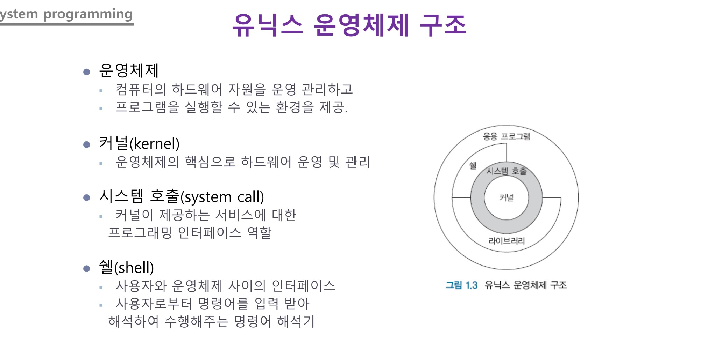
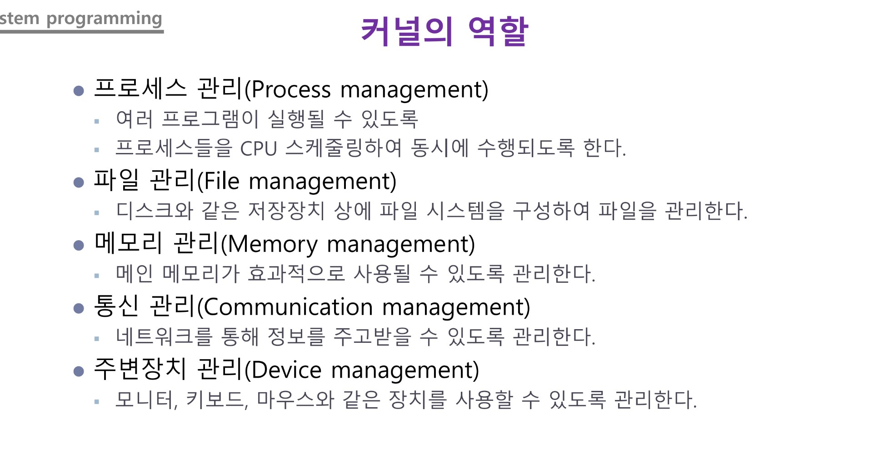

## Class0312 수업 정리

### 수업내용

운영체제는 프로그램을 실행할 수 있는 환경이다.

커널은 운영 체제를 구성하는 프로세서와 운영 체제의 제어로 수행되는 프로그램에 대하여 자원 할당을 수행하는 부분이다.

시스템 호출은 운영 체제의 커널이 제공하는 서비스에 대해, 응용 프로그램의 요청에 따라 커널에 접근하기 위한 인터페이스이다.

쉘은 명령어 해석기, 운영체제와 사용자가 연결해주는 프로그램을 말한다. 

라이브러리, 모듈을 만든 것을 커널이라고 한다. 

커널의 역할은 프로세스 관리, 파일 관리, 메모리 관리, 통신 관리, 주변장치 관리 등이 있다.

