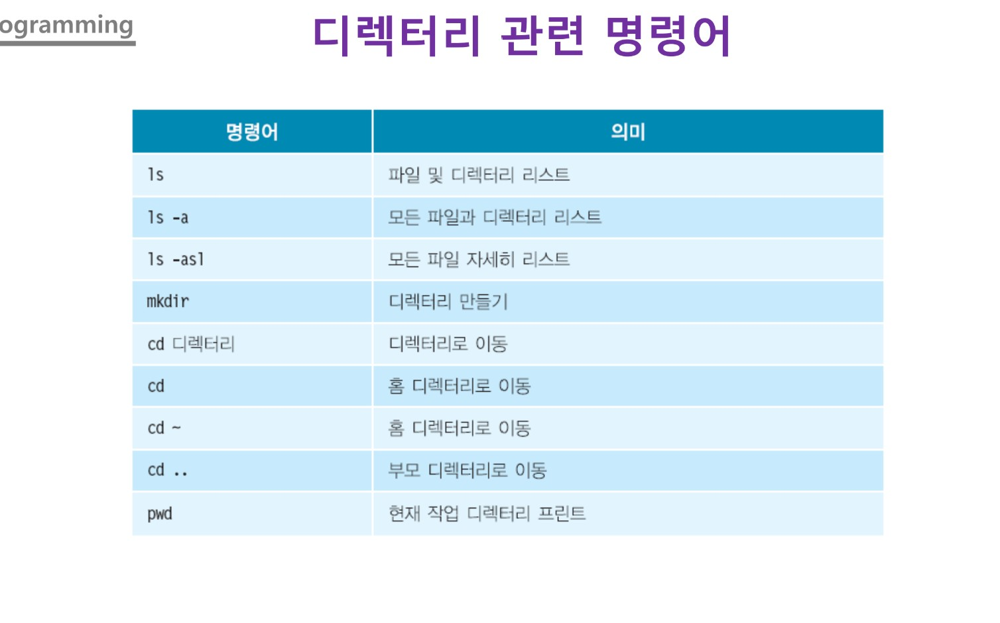
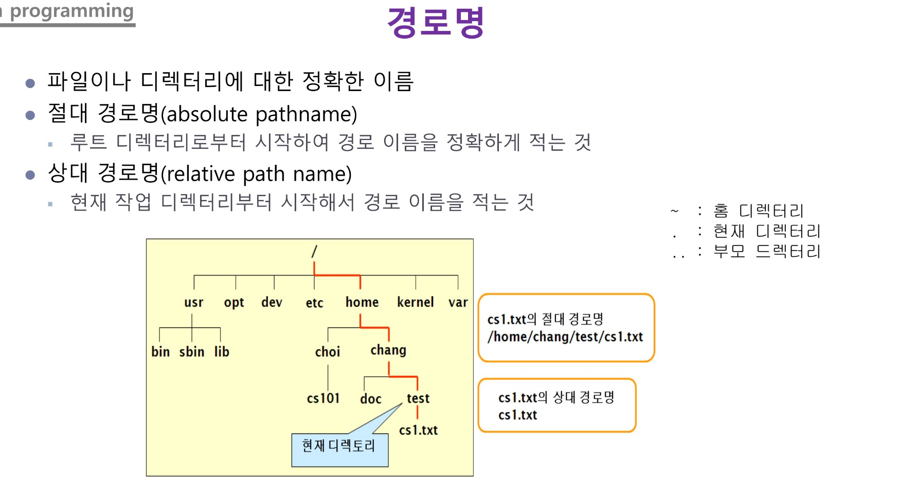
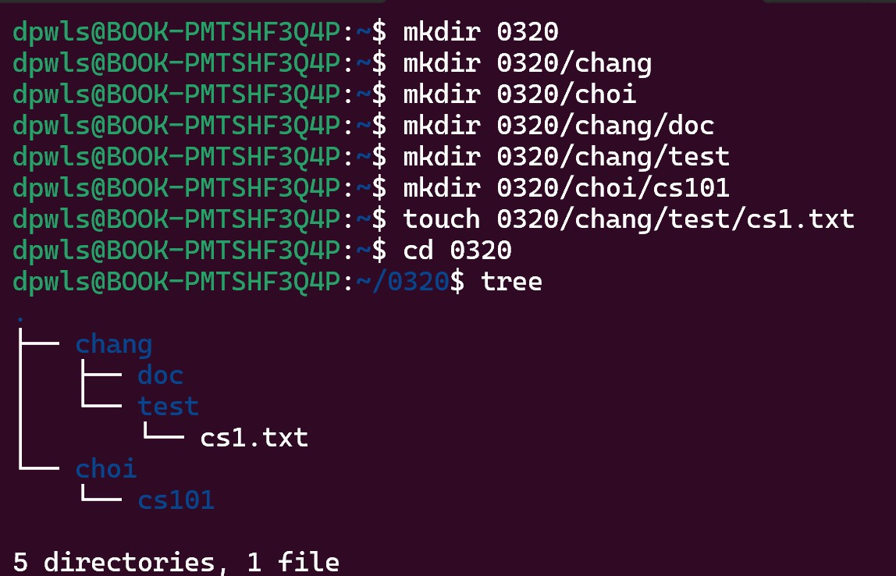
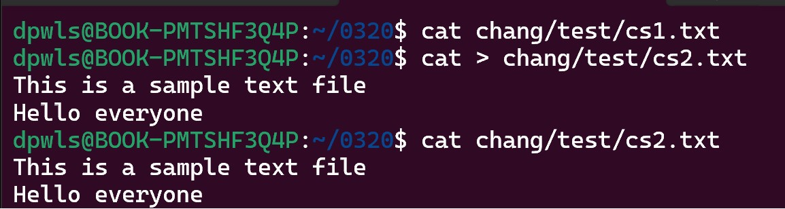
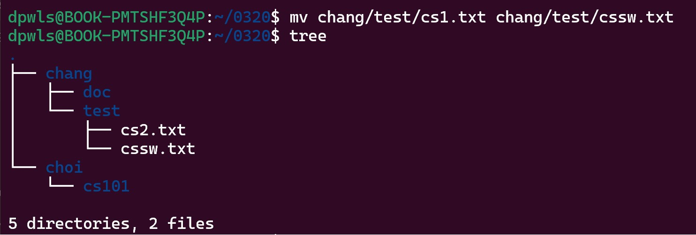
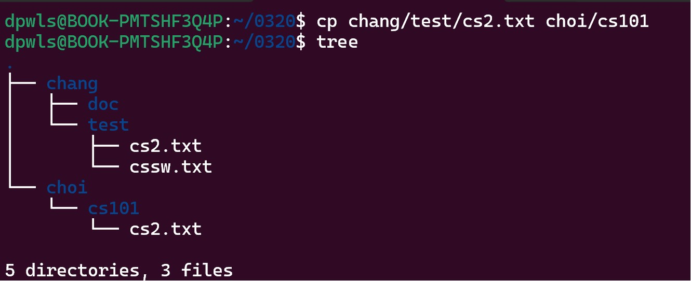
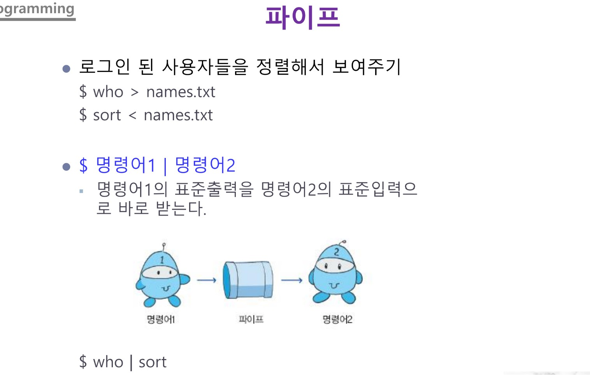

## Class0319 수업 정리

### 수업내용

[ 명령어 ]

cd는 홈 디렉터리로 이동

mkdir는 디렉터리 만들기

touch는 파일 만들기

mv는 파일 이름 변경

cp는 파일 복사본 만들기

cat은 파일 내용 출력

rm 파일, 디렉터리 삭제

 

경로명따라 디렉터리와 파일을 만들어보자.

 

이미지에 보이는 것과 같이 명령어를 입력하면 만들 수 있다.

 
<h3>명령어 활용하기<h3>

cat명령어로 cs2.txt에 내용적기

 

0320/chang/test/cs1.txt의 이름을 cssw.txt로 변경하기

 

0320/chang/test/cs2.txt파일을 choi/cs101로 복사하기

 

파이프(|)는 두 프로세스 간에 데이터를 전달하는 데 사용되는 것으로
이는 한 프로세스의 출력이 다른 프로세스의 입력으로 전달되는 것이다.

 