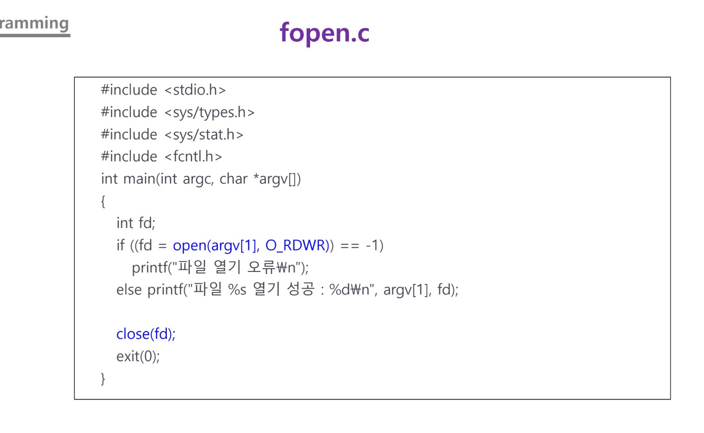

## Class0402 수업 정리

### 수업내용

make는 Linux 운영체제 기반으로 소스 코드를 컴파일하고 빌드하기 위한 자동화 도구이다.

makefile은 실행 파일을 만들기 위해 필요한 파일들과 만드는 방법을 기술한다.

main.c 코드

hello.c 코드

hello.h 코드

world.c 코드

world.h 코드

Makefile 코드

실행

더 간단하게 구성한 Makefile 코드

실행

하드웨어를 운영관리하여 서비스를 제공한다.

파일 관리, 프로세솬리, 메모리 관리, 통신 관리, 주변장치 관리와 같은 서비스를 제공한다.

fopen.c 코드

실행

0600

실행
