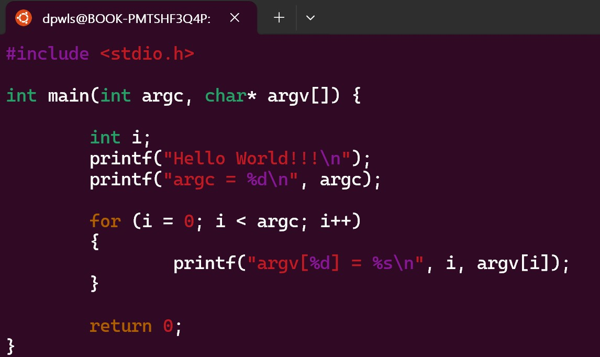

## Class0409 수업 정리

### File Descriptor 발표
<a href="https://dpwls03.github.io/Systempro/0409/File descriptor.pdf">[발표자료]</a>

[발표내용]

파일 디스크립터는 프로세스에서 열린 파일의 목록을 관리하는 테이블의 인덱스, 
리눅스 운영 체계에서 파일에 대한 정보를 기술하고 유지하는 기억 장치의 영역이라고 할 수 있다.

표준스트림에는 0, 1, 2가 있다. 
0 표준입력은 프로그램으로 들어가는 데이터 스트림이다. 
1 표준출력은 프로그램이 출력 데이터를 기록하는 스트림이다. 
2 표준에러는 프로그램이 오류 메시지를 출력하기 위해 일반적으로 쓰는 또 다른 출력 스트림이다. 

표준스트림이 정해져 있기 때문에 우리가 파일을 열때 항상 3부터 할당 받게 된다.

### 수업내용

fsize.c 코드

fsize.c 실행

copy.c 코드

dup.c 코드

dup()함수는 기존 파일 디스크립터를 복제해서 새로운 파일 디스크립터를 반환하는 함수이다.

lseek()함수는 임의의 위치로 파일 위치 포인터를 이동시킬 수 있다.

이동에 성공하면 현재 위치를 리턴하고 실패하면 -1을 리턴한다.

student.h 코드

dbcreate.c 코드

dbquery.c 코드

dbupdate.c 코드

open() 시스템 호출은 파일을 열고 열린 파일의 파일 디스크립터를 반환한다.

파일 위치 포인터는 파일 내에 읽거나 쓸 위치인 현재 파일 위치를 가리킨다.

#### Argc, Argv

코드

실행

#### ssixe_t, size_t

코드

실행

#### File Desciptor

코드

실행
