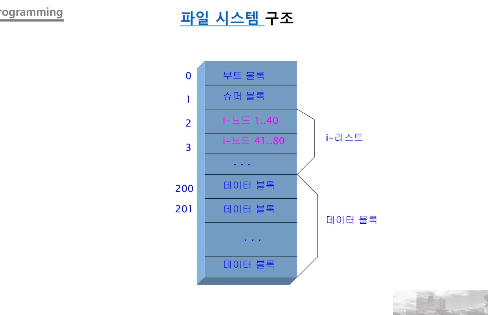
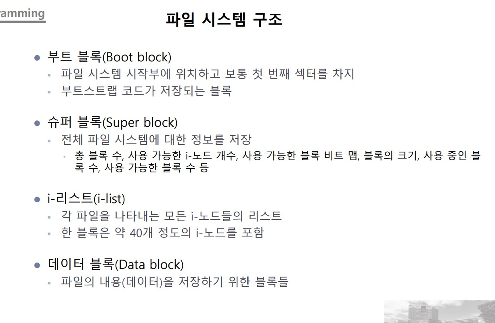
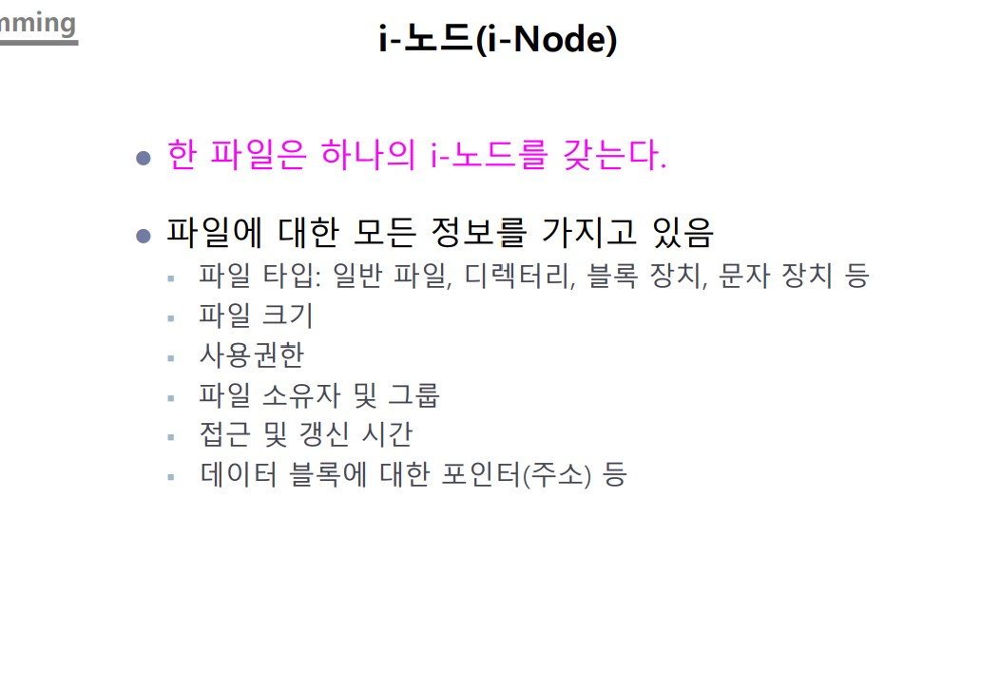
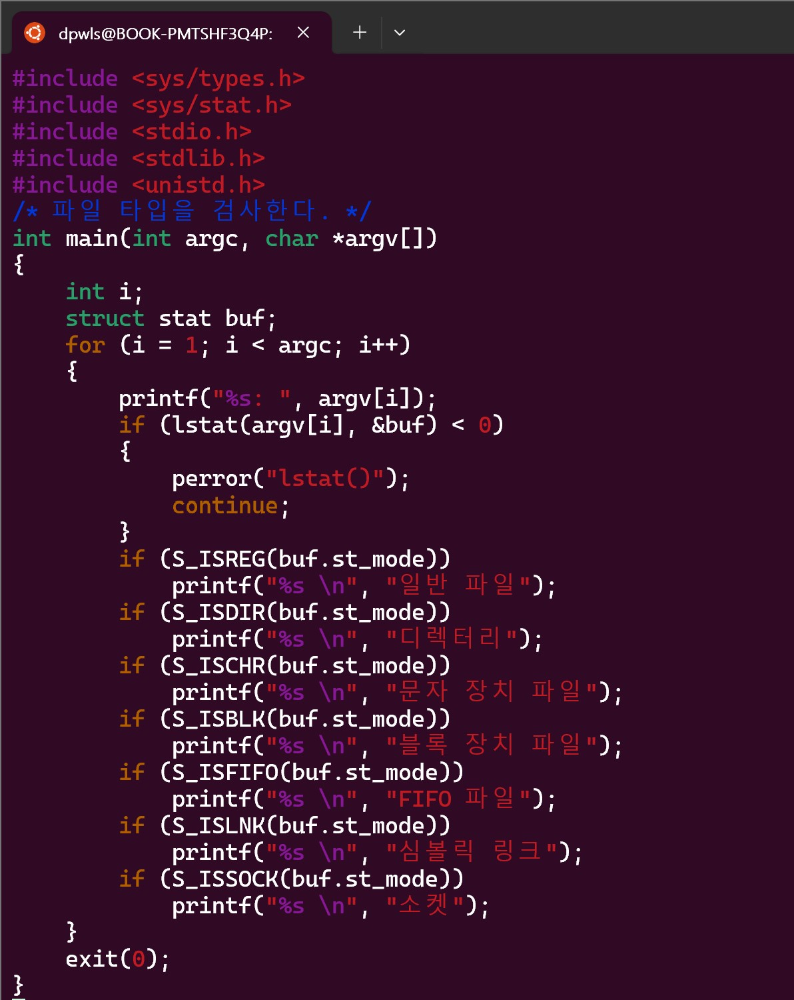
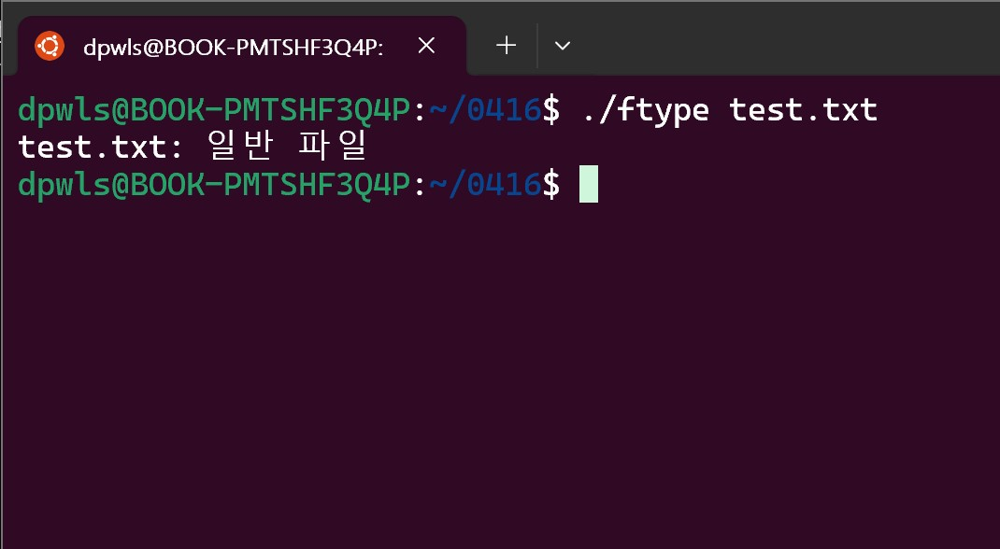
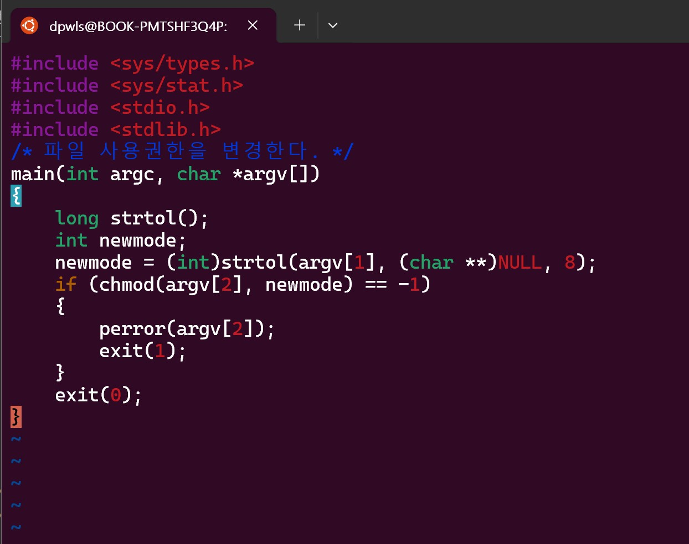
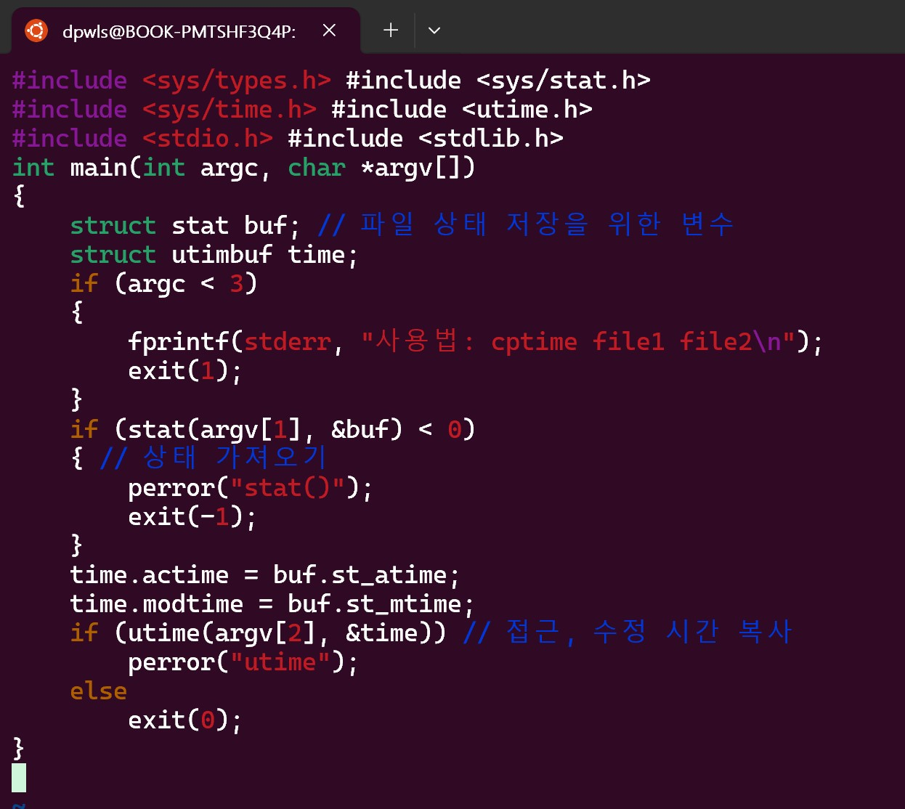

## Class0416 수업 정리

### 수업내용

부트 블록은 부트스트랩 코드가 저장되는 블록이다.

슈퍼 블록은 전체 파일 시스템에 대한 정보를 저장하는 블록이다.

i-리스트는 각 파일을 나타내는 모든 i-노드들의 리스트이다.

데이터 블록은 파일의 내용을 저장 블록이다.

파일의 실질적인 내용은 데이터 블록에 저장되고 파일의 정보는 i-node에 있어야 한다.

한 파일은 하나의 i 노드를 갖는다.

ls 명령어는 i노드를 읽어와서 보여준다.

ftype.c 코드

ftype.c 실행

fchmod.c 코드

cptime.c 코드
