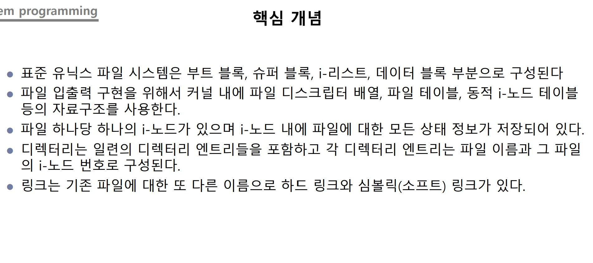

## Class0430 수업 정리

### 수업내용

표준 유닉스 파일 시스템은 부트 블록, 슈퍼 블록, i-리스트, 데이터 블록 부분으로 구성된다.

커널 내에 파일 디스크립터 배열, 파일 테이블, 동적 i-노드 테이블등의 자료구조를 사용한다.

디렉터리는 파일을 관리, 파일의 연관된 것들의 집합이다. 파일의 내용이 저장되고 파일의 형식 영역으로 관리한다.

파일은 바이트의 연속이다.

디렉터리는 일련의 디렉터리 엔트리들을 포함하고 각 디렉터리 엔트리는 파일 이름과 그 파일의 i-노드 번호로 구성된다.

list1.c 코드

list1.c 실행

list2.c 코드

link.c 코드

unlink.c 코드

symlink.c 코드

rlink.c 코드
