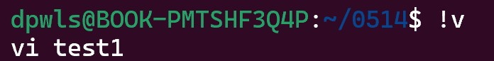
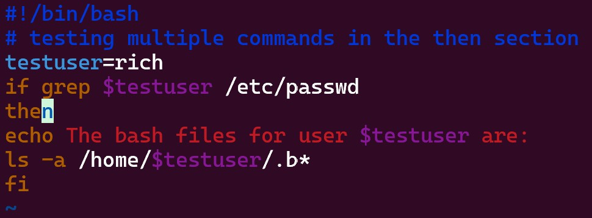

## Class0514 수업 정리

### 수업내용

221페이지 date; who 현재 날짜 시간 나옴

echo는 뒤에 문장 출력

!v라고 하면 v로 시작한 최근에 사용한 명령어 출력

10장 test1 코드

10장 test1 실행

10장 test2 코드

10장 test2 실행

uid 위치

10장 test3 코드

10장 test3 실행

10장 test4 코드

10장 test4 실행

10장 test0 실행

10장 test5 코드

10장 test5 실행

10장 test6 코드

10장 test6 실행

10장 test7 코드

10장 test7 실행

10장 test8 코드

10장 test8 실행

10장 test13 코드

10장 test13 실행

10장 test14 코드

10장 test14 실행

10장 test14b 코드

10장 test14b 실행

11장 test1 코드

11장 test1 실행

11장 test2 코드

11장 test2 실행

11장 test3 코드

11장 test3 실행

11장 test4 코드

11장 test4 실행

11장 test5 코드

11장 test5 실행

11장 test7 코드

11장 test7 실행

11장 test8 코드

11장 test8 실행
