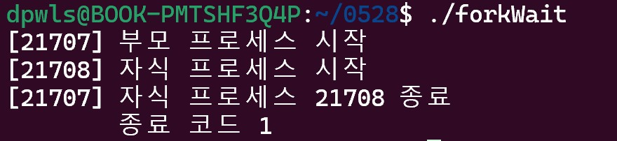

## Class0528 수업 정리

### Format 발표
<a href="https://dpwls03.github.io/Systempro/0528/format, row format, low format.pdf">[발표자료]</a>

[발표내용]

포맷은 기존의 파일시스템을 지우고 새롭게 파일시스템을 구축하는 것이다.

즉, 기존 파일시스템에 기록된 폴더의 구조, 파일명, 파일의 위치 등이 지워지게 되는 것이다.

### 수업내용

C 프로그램 시작 및 종료

passwd 명령어

passwd는 루트가 실행권한을 갖는 파일이고 특별한 실행권한이 필요하다.

passwd = 패스워드 변경

0이 출력된 것은 return 0을 의미

fork()는 자기 자신을 복제하는 함수이다.

fork()는 한 번 호출되면 두 번 리턴한다.

자식 프로세스에게는 0을 리턴하고,
부모 프로세스에게는 자식 프로세스 ID를 리턴한다.

fork1.c 코드

fork1.c 실행

fork2.c 코드

fork2.c 실행

fork3.c 코드

fork3.c 실행

forkWait.c 코드

forkWiat.c 실행

waitPid.c 코드

waitPid.c 실행

exec1.c 코드

exec1.c 실행

exec2.c 코드

exec2.c 실행

exec3.c 코드

exec3.c 실행

systemTest.c 코드

systemTest.c 실행

system.c 코드

system.c 코드

systemCall.c 코드

systemCall.c 실행
