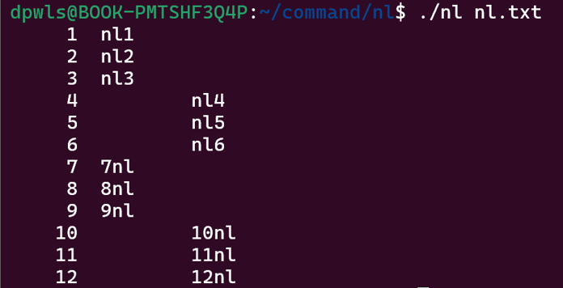
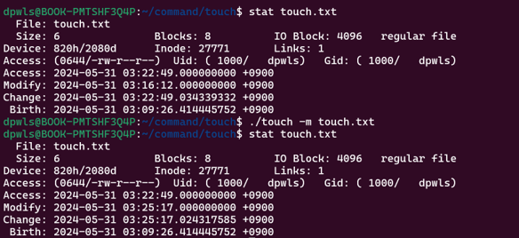

## 명령어 코드 구현하기

### cat

#### cat - 파일의 내용을 화면에 출력

#### cat -n - 모든 라인 앞에 라인 번호를 출력

#### cat -b - 비어있지 않은 라인 앞에만 라인번호를 출력

#### cat -E - 라인의 마지막과 비어있는 라인에 '$' 기호를 출력

#### cat -T - 탭 문자를 '^I' 표시로 바꿔서 출력

#### cat -A - 라인의 마지막과 비어있는 라인에 '$' 기호 출력, 탭 문자는 '^l' 로 바꿔서 출력

#### cat -s - 두 번 이상 연속된 빈 라인은 출력하지 않음

### head

#### head - 파일의 앞 10줄을 출력

#### head -v - 파일명을 출력하고  파일 내용의 앞 10줄을 출력

#### head -q - 파일명을 출력하지 않고 파일 내용의 앞 10줄을 출력

#### head -n 숫자 - 지정한 숫자 만큼의 행을 출력

### chmod

#### chmod - 파일의 권한을 설정

### cp

#### cp - 파일을 복사

### pwd

#### pwd - 현재 위치한 경로를 절대 경로로 출력

### mkdir

#### mkdir - 디렉토리를 생성

#### mkdir -v - 디렉토리를 생성하고 생성된 디렉토리에 대한 메시지 출력

### nl

#### nl - 텍스트 파일의 각 줄에 줄 번호를 붙여 출력

### rm

#### rm - 파일을 제거

#### rm -d - 비어있는 디렉토리를 제거

### rmdir

#### rmdir - 빈 디렉토리 삭제

#### rmdir -v - 빈 디렉토리 제거 후 삭제 되었다는 메시지를 출력

### tail

#### tail - 파일의 마지막 10줄을 출력

#### tail -v - 파일명을 출력하고 파일의 마지막 10줄을 출력

#### tail -q - 파일명을 출력하고 파일의 마지막 10줄을 출력

#### tail -n 숫자 - 입력받은 라인 수 만큼 파일의 마지막 부분에서 출력

### touch

#### touch - 파일의 접근시간과 수정 시간을 현재 시간으로 업데이트

#### touch -a - 파일의 접근시간을 현재 시간으로 업데이트

#### touch -m - 파일의 수정시간을 현재 시간으로 업데이트

#### touch -d - 지정한 시간으로 접근시간과 수정시간을 업데이트(string으로 data를 입력받는다.)

#### touch -c - 존재하지 않는 파일을 수정하려해도 새로운 파일을 생성하지 않는다.

